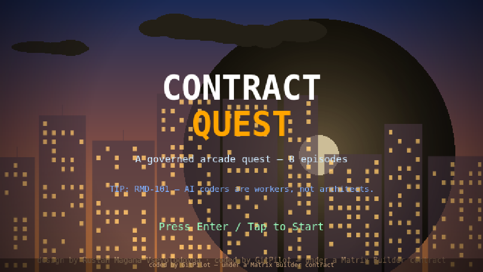
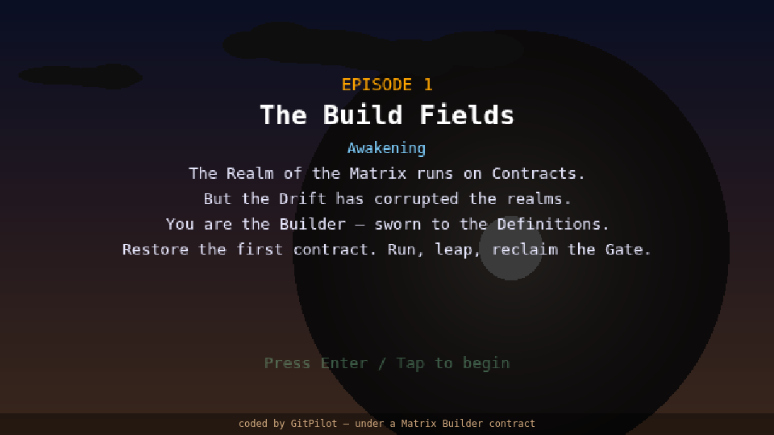
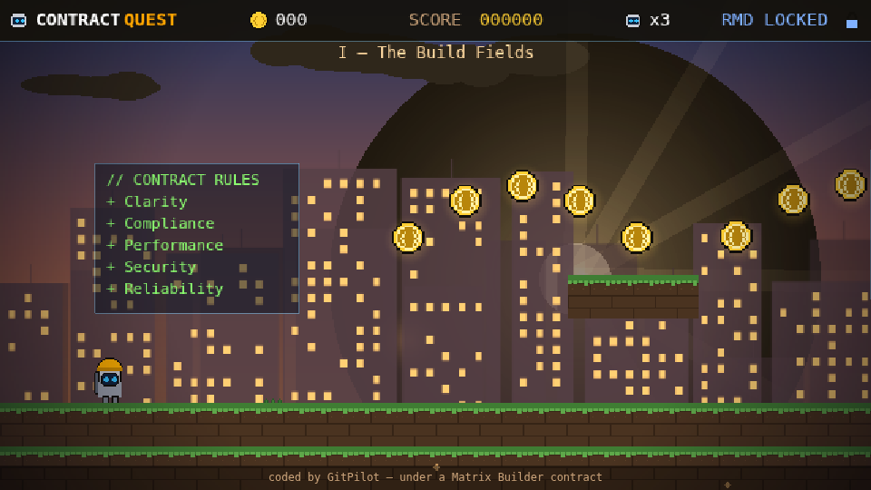

<div align="center">

<h1>🛡️ Contract Quest</h1>
<h3>An 8-episode governed arcade quest — <b>Phaser 3 · TypeScript · Vite</b></h3>

<p>A real, buildable game engine (not a single HTML file): static, client-side, deployable to GitHub
Pages. A <b>Super Mario Bros-style 8-episode campaign</b> with story, power-ups, a boss and end
credits — grown <b>without ever rewriting the engine</b>. Governed by <a href="https://github.com/agent-matrix/matrix-builder">Matrix Builder</a>
contracts and the <b>Ruslan Magana Definitions (RMD)</b>.</p>

<p>
  
  
  
  
  
  
  
</p>



<sub><i>IT design by Ruslan Magana Vsevolodovna · coded by GitPilot — under a Matrix Builder contract</i></sub>

</div>

---

## The quest

The Realm of the Matrix runs on **Contracts** — but **the Drift** has corrupted the realms. You are
the **Builder**, sworn to the Definitions. Restore each contract, episode by episode, run and leap
and reclaim the **Matrix Gate**, and climb to the **Architect's Sanctum** to face the **Rogue
Architect** and end the Drift.

<table>
<tr>
<td width="50%"></td>
<td width="50%"></td>
</tr>
<tr>
<td align="center"><sub>Per-episode narrative card</sub></td>
<td align="center"><sub>Episode I — parallax city, contract panels, round Contract Coins</sub></td>
</tr>
</table>

**Controls** — `←/→` or `A/D` move · `Space/↑/W` jump (variable height; **double-jump** when earned)
· `Enter` advance. On touch devices, on-screen buttons appear.

## 🎮 The 8 episodes — simplest to hardest

A full campaign that ramps like a classic platformer: gentle introduction → moving platforms and
hazards → atmosphere and verticality → the final boss.

| # | Episode | Theme | Introduces |
|---|---|---|---|
| I | **The Build Fields** | *Awakening* | run, jump, Contract Coins, the Matrix Gate |
| II | **The Dependency Cavern** | *Tangled paths* | tighter platforming, Prompt Slimes |
| III | **The Validation Gate** | *The verdict* | the **Shield** power-up, tougher enemies |
| IV | **The Parallax Heights** | *Ascend* | **moving platforms**, the **Double Jump** |
| V | **The Cache Marshes** | *Stale ground* | wider gaps, mixed enemy waves |
| VI | **The Pipeline Foundry** | *Build · Test · Deploy* | long level, dense coin arcs |
| VII | **The Drift Expanse** | *Into the Drift* | the hardest platforming gauntlet |
| VIII | **The Architect's Sanctum** | *The Rogue Architect* | **boss fight** → Victory → **Credits** |

Beat the Sanctum and the game rolls **scrolling end credits** — *Game design & direction: Ruslan
Magana Vsevolodovna*, GitPilot, Matrix Builder, and the RMD rules.

## 🧩 Scalable & safe: episodes are *data, not code*

This is the point of the repo. **Adding an episode = adding one config object. The engine never
changes.** Each episode is a small, scoped, validated, additive entry — *a batch in another form* —
so a whole team (or a fleet of contract-bound AI agents) can add episodes, enemies and mechanics in
parallel while the engine, the standards, and the `mb check` gate stay fixed.

```ts
// src/levels/episodes.ts  — one entry per episode; buildEpisode() reads it. No engine edits.
{
  id: 4, title: "IV — The Parallax Heights", subtitle: "Ascend",
  story: ["The spires of the old build pierce the dusk.", "Climb. The higher contracts await."],
  width: 3000, platforms: 10, enemies: 5, slimeRatio: 0.5,
  moving: true, coinArcs: 4, djump: true, accent: 0x00f0ff, seed: 44,
}
```

A deterministic seed means each episode always generates the same hand-tunable layout. That's how
this scales from a 56 KB demo to a real title the same way you'd grow a 10-million-line engine:
**content scales, governance holds.**

## ✅ Verified to build & run

```text
npm install        → 144 packages
npm run typecheck  → clean (tsc --noEmit)
npm run build      → dist/ produced (Phaser bundle ~343 KB gzipped)
headless browser   → 8 episodes load, hero moves/jumps, round coins, ZERO runtime errors
```

It runs immediately with **original pixel-art** generated programmatically — hero sprite sheet, Bug
Bot, Prompt Slime, mossy/metal tiles, round Contract Coins, RMD Star, Matrix Gate, parallax sky +
two city skylines, glow, vignette, embers, HUD icons. *(All original art — no copyrighted assets.)*

## Reproduce it locally

```bash
git clone https://github.com/ruslanmv/contract-quest
cd contract-quest
npm install
npm run dev                # → http://localhost:5173/  (hot reload)
# or
npm run build && npm run preview
python3 scripts/gen_assets.py   # regenerate the original pixel-art set
```

> **GitHub Pages base:** set `base` in `vite.config.ts` (or the `VITE_BASE` env) to `/<your-repo>/`
> so asset URLs resolve. Default is `/contract-quest/`.

## Architecture

```
contract-quest/
├── index.html                 # canvas mount + footer credit
├── vite.config.ts             # base path for GitHub Pages
├── src/
│   ├── main.ts                # Phaser config (pixelArt, Arcade physics, FIT scale)
│   ├── scenes/
│   │   ├── Boot/Preload       # generate/load the original pixel-art set
│   │   ├── TitleScene         # splash · rotating RMD tips · "design by Ruslan Magana V."
│   │   ├── StoryScene         # per-episode narrative card
│   │   ├── GameScene          # episode-driven world: parallax, coins, enemies, boss, gate
│   │   ├── VictoryScene       # "The Matrix Gate reclaimed" + final score
│   │   └── CreditsScene       # scrolling end credits
│   ├── levels/
│   │   ├── episodes.ts        # ← the campaign DATA (8 episode config objects)
│   │   └── builder.ts         # seeded buildEpisode(cfg) → world (engine, never per-episode)
│   ├── entities/              # Player (variable + double jump, shield), BugBot, Slime, Coin
│   ├── ui/ · utils/           # HUD, touch controls, palette/tuning, textures
├── scripts/gen_assets.py      # PIL — generates all original pixel-art assets
├── docs/ARCHITECTURE.md · docs/ASSET_PROMPTS.md
├── .github/workflows/deploy.yml   # CI: typecheck → build → deploy to Pages
└── MATRIX_*.{yaml,lock,md}     # the contract identity + RMD governance + batch plan
```

To reach an *exact* concept-art look, replace the PNGs in `public/assets/` with an image model — same
names/sizes → zero code changes. See [`docs/ASSET_PROMPTS.md`](docs/ASSET_PROMPTS.md).

## How it was built — GitPilot under Matrix Builder

The engineering was written by **[GitPilot](https://gitpilot.ruslanmv.com)** (Claude or watsonx —
your choice) one **governed batch** at a time: `mb next → mb prompt --coder gitpilot →
gitpilot generate → mb check`. Each batch is scoped to an allow-list of files and **fail-closed** —
if the model writes outside scope or misses an acceptance criterion, `mb check` returns
`needs-repair` and nothing ships. The campaign then grew the same way: **each episode is just another
additive, validated batch.**

## RMD governance

- **RMD-101** — AI coders are workers, not architects.
- **RMD-103** — Control files are protected.
- **RMD-111** — Acceptance criteria are law.

Full design (data models, asset pipeline, batch plan) is in
[`docs/ARCHITECTURE.md`](docs/ARCHITECTURE.md) and the `MATRIX_*` files.

## Tech stack

**TypeScript** · **Vite 5** · **Phaser 3** · Arcade physics · ESLint/Prettier · GitHub Actions →
Pages. No backend, no runtime AI calls. AI is used only to *assist writing code*. No API keys are
committed.

---

<div align="center"><sub>🛡️ <b>IT design by Ruslan Magana Vsevolodovna</b> · coded by GitPilot — under a Matrix Builder contract · <a href="https://ruslanmv.com">ruslanmv.com</a> · MIT licensed</sub></div>
